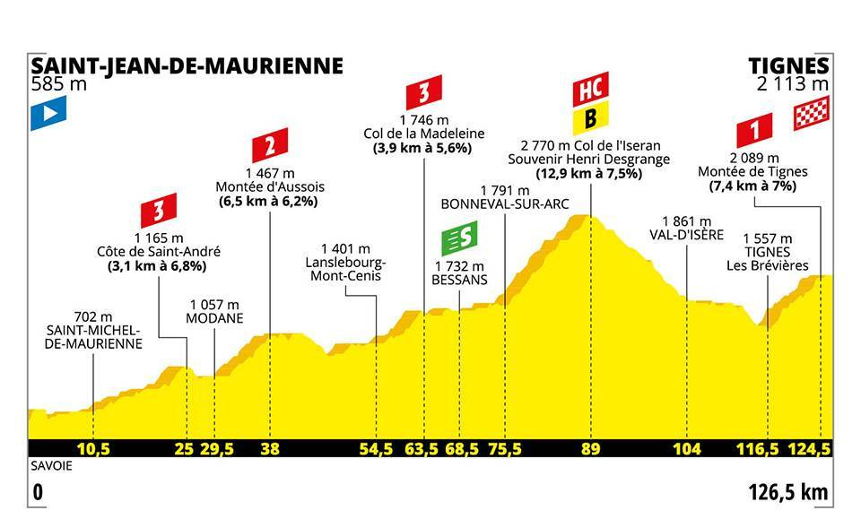

# README

General ranking data of the Tour de France 2019. Scrapped from https://letour.fr.

## Data

- [general_classification.json](./general_classification.json): the general ranking, after each stage of the Tour de France 2019.

  ```json
  [
    [
      {
        "rank": 1,
        "name": "MIKE TEUNISSEN",
        "number": 87,
        "team": "TEAM JUMBO - VISMA",
        "time": 15767,
        "gap": 0,
        "bonif": 10,
        "penal": 0,
        "raw": "1|MIKE TEUNISSEN|87|TEAM JUMBO - VISMA|04h 22' 47''|-|B : 10''|-"
      },
      {
        "rank": 2,
        "name": "PETER SAGAN",
        "number": 11,
        "team": "BORA - HANSGROHE",
        "time": 15767,
        "gap": 0,
        "bonif": 6,
        "penal": 0,
        "raw": "2|PETER SAGAN|11|BORA - HANSGROHE|04h 22' 47''|-|B : 6''|-"
      }
    ]
  ]
  ```

- [teams.json](./teams.json): the 22 teams

  ```json
  [
    { "name": "TEAM INEOS", "colour": "#910024" },
    { "name": "BORA - HANSGROHE", "colour": "#76BFCB" }
  ]
  ```

- [profile_images](./profile_images/): elevation profile image of every stage

  

- [riders_images](./riders_images/): picture of the 6 main riders

  

## Rebuild the data

Get general rankings ([general_classification.json](./general_classification.json))

```
python3 build_general_classification.py
```

Note that `build_general_classification.py` doesn't download the HTML pages, but requires them to be available locally (they have been saved on 29 of July in [saved_html](./saved_html/) directory).

The [profile_images](./profile_images/) and [riders_images](./riders_images/) files have also been downloaded manually.

### Note on previous strategy - don't use it

I first got the everyday stage rankings and summed them up to get the general rankings. I did it this way because it was easier to automatically get the HTML with stage rankings. But the stage 20 ranking has never been released (the stage has been modified due to weather conditions), so I changed my strategy, manually downloaded the 22 general ranking HTML webpages (see [saved_html](./saved_html/)) and scrapped from them using [general_classification.json](./general_classification.json). To get the data using the first strategy ([general_classification_previous_strategy.json](./general_classification_previous_strategy.json)), launch

```
# Don't use it, just for historical purpose
python3 build_general_classification_previous_strategy.py
```
